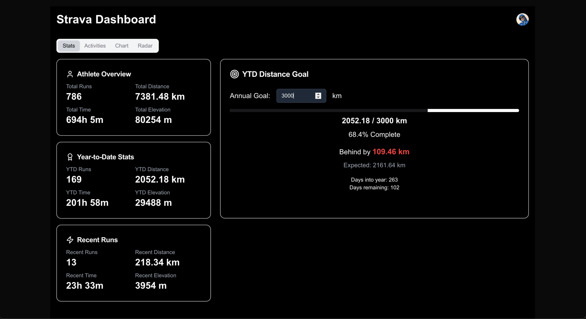
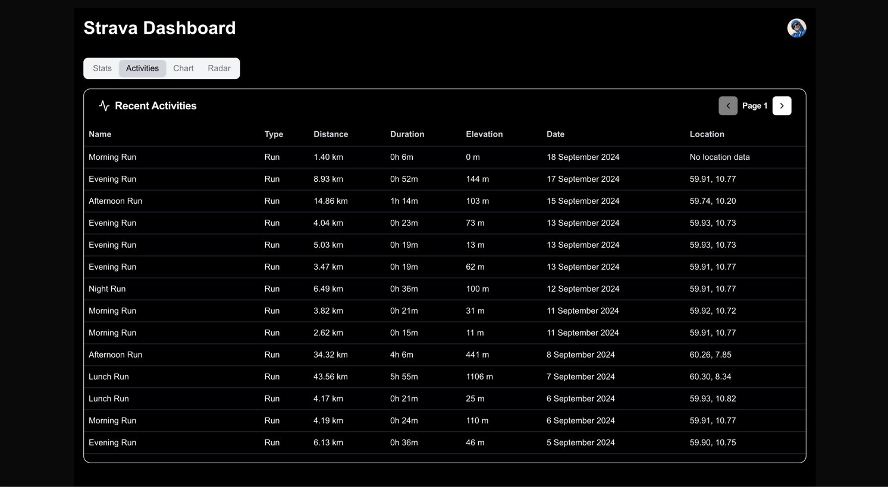
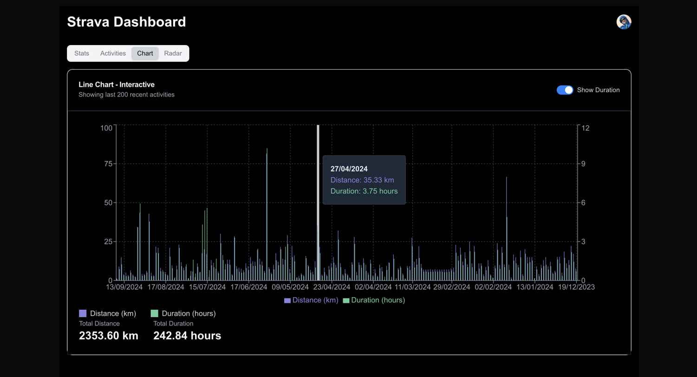

Strava Visualiser
====================================================================
#### Made with Next.JS / Shadcn /  Strava API / v0.dev / Vercel

### Dashboard ###
* Gives a brief overview of the athlete stats, including total runs, distance and time running
* Year-To-Data stats shows the current stats so far this year
* Recent runs shows the last months data
* There is also a service to adjust annual goal, and visualise completion and how far ahead, or behind the goal you are based on the day of the year

### Activities ###
* Shows a table of all activities. 
* The Strava API has a limitation of 200 activities per API call, which is bypassed through pagination

### Chart ###
* An interactive chart where you can toggle between showing duration of the activity, or only distance for a cleaner look
* Here we pull the maximum amount of data, which is the 200 last activities

This is a [Next.js](https://nextjs.org) project bootstrapped with [`create-next-app`](https://nextjs.org/docs/app/api-reference/cli/create-next-app).

